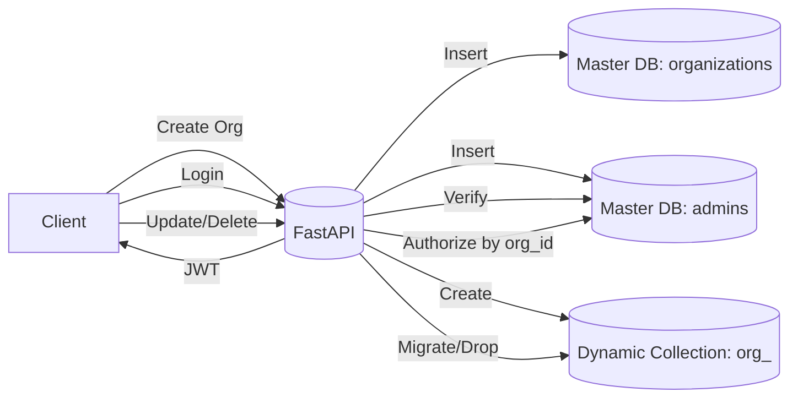

# Organization Management Service (FastAPI + MongoDB)

A backend service for managing multi-tenant organizations using FastAPI, MongoDB, and JWT authentication.

## ✨ Features
- Create organizations with a dedicated dynamic collection (`acme`)
- Master database tracks organizations and admins
- Secure admin creation with **bcrypt**-hashed passwords
- JWT-based authentication for protected actions
- Update org name with safe collection migration
- Delete org (admin-only), including metadata and collections
- Clean, modular structure; ready for Docker

## ▶️ Quick Start

# Run locally
uvicorn app.main:app --reload

# Run via Docker
docker compose up --build

### 1) Local (Python)
```bash
python -m venv .venv && source .venv/bin/activate  # Windows: .venv\Scripts\activate
pip install -r requirements.txt
cp .env.example .env
uvicorn app.main:app --reload
```

Open: http://localhost:8000/docs

### 2) Docker (with Mongo)
```bash
docker compose up --build
```
Open: http://localhost:8000/docs

## 🔧 Environment
Copy `.env.example` to `.env` and edit as needed.

| Variable | Purpose |
|---|---|
| `MONGO_URI` | Mongo connection string |
| `MASTER_DB` | Master database name |
| `JWT_SECRET` | Secret for JWT signing |
| `JWT_ALGORITHM` | Algorithm (default HS256) |
| `JWT_EXPIRE_MINUTES` | JWT expiry minutes |

## 🗂️ API Endpoints (per assignment)

- `POST /org/create` – Create organization + admin; dynamic collection
- `GET /org/get?organization_name=` – Get org metadata
- `PUT /org/update` – Rename org + migrate collection (JWT required)
- `DELETE /org/delete` – Delete org and its data (JWT required)
- `POST /admin/login` – Admin login (returns JWT with `email` and `org_id`)

### Example Request Bodies
```jsonc
// POST /org/create
{
  "organization_name": "Acme",
  "email": "admin@acme.com",
  "password": "Secret123"
}
```
```jsonc
// POST /admin/login
{
  "email": "admin@acme.com",
  "password": "Secret123"
}
```
Use the token as: `Authorization: Bearer <token>`.

```jsonc
// PUT /org/update
{
  "organization_name": "Acme",
  "new_organization_name": "AcmeNew",
  "email": "admin@acme.com",
  "password": "Secret123"
}
```
```jsonc
// DELETE /org/delete
{
  "organization_name": "AcmeNew"
}
```

## 🗃️ Data Model (Master DB)

- `organizations`
  - `organization_name` (unique, lowercase)
  - `collection_name` (dynamic, e.g., `org_acmenew`)
  - `created_at`, `updated_at`
- `admins`
  - `org_id` (ref to organizations._id)
  - `email` (unique)
  - `password_hash`
  - `is_super_admin`
  - timestamps

## 🔐 Auth
- Passwords are hashed with **bcrypt**.
- JWT payload includes `email` and `org_id`.
- Protected routes require `Authorization: Bearer <token>`.

## 🧪 Manual Test Flow
1. `POST /org/create` with org name + admin email/password.
2. `POST /admin/login` → get `access_token`.
3. `GET /org/get?organization_name=acme` → verify metadata.
4. `PUT /org/update` (send token) to rename the org.
5. `DELETE /org/delete` (send token) to remove org + collections.

## 🧱 Assumptions
- All org collections live in the same Mongo database for simplicity.
- Collection migration is implemented by **copy → drop** for broad compatibility.
- Admin authorization is scoped by `org_id` inside the token.

## 🧭 High-Level Diagram


## 🚀 Deploy (Vercel/Render/Any Docker host)
- Build Docker image and deploy.
- Make sure to set env vars (`MONGO_URI`, `MASTER_DB`, `JWT_SECRET`, ...).
- For Render: Use a **Web Service** with `Dockerfile` and add a free **Mongo Atlas** cluster.

## 📁 Project Structure
```
org-mgmt-service/
  app/
    __init__.py
    main.py
    config.py
    database.py
    models.py
    auth.py
    deps.py
    routers_orgs.py
  requirements.txt
  Dockerfile
  docker-compose.yml
  .env.example
  README.md
```

## 📌 Notes on Scalability / Trade-offs
- **Pros**: Simple, fast to build, single DB connection, clear tenant isolation at collection level.
- **Trade-offs**: Very large number of tenants → namespace clutter; per-tenant performance isolation is limited.
- **Alternatives**:
  - **Database-per-tenant** (stronger isolation, costlier ops).
  - **Shared collections with org_id** (fewer collections, needs strict query filters + indexes).
- For high scale, consider: connection pooling, background migrations, rate limits, per-tenant RBAC, and observability.

---

